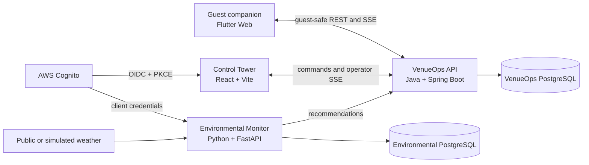

# Lumen Marsh

Lumen Marsh is a fictional theme-park operations platform built as a portfolio demonstration. It connects a guest experience, an operator control tower, an operational API, and an environmental monitoring service in one observable workflow.

> Lumen Marsh is an independent fictional project. It is not affiliated with, endorsed by, or based on proprietary systems from Universal Destinations & Experiences or any other theme-park operator.

## What it demonstrates

- Human-in-the-loop operational decisions instead of automatic ride closures
- Explicit attraction and incident state transitions with optimistic concurrency
- Role- and scope-based authorization through Cognito OIDC
- Guest-safe projections that keep internal operational details private
- Live operator and guest updates using server-sent events
- Auditable commands, actors, versions, and correlation identifiers
- Java, Python, React, Flutter, PostgreSQL, Docker Compose, and OpenTofu working as one system

## Architecture



| Directory | Responsibility |
| --- | --- |
| [`venueops-api`](./venueops-api) | Attractions, incidents, advisories, audit history, and event streams |
| [`environmental-monitor`](./environmental-monitor) | Weather ingestion, fictional safety rules, and recommendations |
| [`venueops-console`](./venueops-console) | Authenticated operator and supervisor control tower |
| [`lumen-marsh-app`](./lumen-marsh-app) | Guest attraction catalog and live park advisories |
| [`lumen-marsh-platform`](./lumen-marsh-platform) | Compose orchestration, demo automation, security docs, and infrastructure as code |

## Run the complete system locally

Prerequisites: Docker Desktop, `curl`, and Python 3.

```bash
cd lumen-marsh-platform
cp .env.example .env
# Set NWS_USER_AGENT to identify your local weather.gov client.
./scripts/dev-up.sh
```

The launcher waits for readiness and prints the actual URLs. The default mode is completely local and does not create AWS resources.

Typical endpoints:

| Surface | URL |
| --- | --- |
| Guest app | <http://localhost:3000> |
| Operator console | <http://localhost:3001> |
| VenueOps API | <http://localhost:8080> |
| Environmental Monitor | <http://localhost:8000> |

Run the repeatable end-to-end proof:

```bash
cd lumen-marsh-platform
./scripts/storm-lifecycle-acceptance.sh
```

The scenario follows weather observation → recommendation → operator review → incident → attraction hold → guest advisory → clearance → testing → return to service. See the [UI walkthrough](./lumen-marsh-platform/docs/storm-lifecycle-demo.md) for the narrated version.

Stop the stack without deleting its databases:

```bash
cd lumen-marsh-platform
./scripts/dev-down.sh
```

## Cognito mode

The optional Cognito-backed development mode uses Authorization Code + PKCE for the console and client credentials for the monitor:

```bash
cd lumen-marsh-platform
./scripts/dev-up.sh --oidc
```

This mode expects an explicitly provisioned development identity stack and local AWS credentials. Credentials, local environment files, and OpenTofu state must never be committed. AWS application deployment remains intentionally deferred.

## Quality checks

Each application can be validated independently. See [CONTRIBUTING.md](./CONTRIBUTING.md) for the commands. Root GitHub Actions run Java, Python, console, Flutter, platform, and security checks on every pull request.

## Security and limitations

Read [SECURITY.md](./SECURITY.md) before deploying or reporting a vulnerability. The local authentication mode uses recognizable development-only bearer values and an ephemeral signing key; it must never be exposed to an untrusted network.

This is a focused portfolio vertical slice, not a production park-control or life-safety system. Weather thresholds and operational behavior are fictional demonstration rules. Current architectural limitations are documented in the [platform README](./lumen-marsh-platform/README.md#known-limitations).
